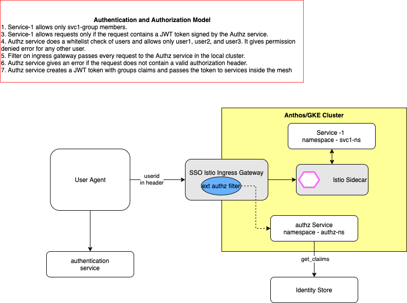

# Enforcing Istio External Authorization in Anthos/GKE Cluster
The following section provides sample code of enforcing Istio External Authorization for a service running inside Anthos/GKE cluster, authorization tests and healthchecks for the grpc based authz service:




## 1. Create GKE Cluster
Create a GKE clusters:

```
gcloud container clusters create cluster-1  \
  --cluster-version latest \
  --machine-type=n1-standard-2 \
  --num-nodes 4 \
  --zone us-central1-a \
  --project my_anthos_project
  ```

```
kubectl create clusterrolebinding cluster-admin-binding \
    --clusterrole=cluster-admin \
    --user=$(gcloud config get-value core/account)
```

## 2. Download Istio

```
export ISTIO_VERSION=1.4.6
wget https://github.com/istio/istio/releases/download/$ISTIO_VERSION/istio-$ISTIO_VERSION-linux.tar.gz
tar xvf istio-$ISTIO_VERSION-linux.tar.gz
rm istio-$ISTIO_VERSION-linux.tar.gz
export PATH=`pwd`:`pwd`/linux-amd64/:$PATH
```

## 3. Deploy Istio on the cluster

```
CTX_CLUSTER1=gke_my_anthos_project_us-central1-a_cluster-1

cd $HOME/istio-1.4.6
kubectl create --context=$CTX_CLUSTER1 ns istio-system
kubectl create --context=$CTX_CLUSTER1 secret generic cacerts -n istio-system --from-file=samples/certs/ca-cert.pem --from-file=samples/certs/ca-key.pem --from-file=samples/certs/root-cert.pem --from-file=samples/certs/cert-chain.pem
istioctl manifest apply --context=$CTX_CLUSTER1 -f install/kubernetes/operator/examples/multicluster/values-istio-multicluster-primary.yaml
```

Sample Output should be the following
✔ Finished applying manifest for component Base.
✔ Finished applying manifest for component Prometheus.
✔ Finished applying manifest for component Citadel.
✔ Finished applying manifest for component Policy.
✔ Finished applying manifest for component Pilot.
✔ Finished applying manifest for component Injector.
✔ Finished applying manifest for component Galley.
✔ Finished applying manifest for component IngressGateway.
✔ Finished applying manifest for component Telemetry.


## 4. Configure Ingress gateway on the cluster
Wait for pods to become ready:

```
kubectl get pods --context=$CTX_CLUSTER1 -n istio-system
```

```
kubectl apply --context=$CTX_CLUSTER1 -f - <<EOF
apiVersion: networking.istio.io/v1alpha3
kind: Gateway
metadata:
  name: cluster-aware-gateway
  namespace: istio-system
spec:
  selector:
    istio: ingressgateway
  servers:
  - port:
      number: 443
      name: tls
      protocol: TLS
    tls:
      mode: AUTO_PASSTHROUGH
    hosts:
    - "*.local"
EOF
```

Note - Although applied to cluster1, this Gateway instance will also affect cluster2 because both clusters communicate with the same Pilot.
Note - The root and intermediate certificate from the samples directory are widely distributed and known. Do not use these certificates in production as your clusters would then be open to security vulnerabilities and compromise.

Get Ingress Gateway External IP from the command below:

```
kubectl --context=$CTX_CLUSTER1 get svc istio-ingressgateway -n istio-system
```

Update the gateway's address and port(443) of network1 to reflect the cluster1 ingress host and port, respectively, then save and quit. Note that the address appears in two places, the second under values.yaml:

```
kubectl edit cm -n istio-system --context=$CTX_CLUSTER1 istio
```

## 5. Deploy apps and services on the cluster


**Services**
Main Cluster (cluster-1)
namespace- svc1-ns
svc1 (Host - svc1.example.com). <br />

svc1.example.com/varz renders env variables
svc1.example.com/headerz renders headers variables

### Deploy ingress-gateway and services

```
cd service
docker build -t mukeshkhattar/svc1 .
docker push mukeshkhattar/svc1
kubectl --context=$CTX_CLUSTER1 apply -f istio-lb-certs.yaml
kubectl --context=$CTX_CLUSTER1 apply -f istio-ingress-gateway-1.yaml
kubectl --context=$CTX_CLUSTER1 apply -f svc1.yaml
kubectl --context=$CTX_CLUSTER1 apply -f svc1-config.yaml
```

## 6. Apply deny-all Istio Policy
```
kubectl --context=$CTX_CLUSTER1 apply -f deny_all.yaml
```

## 7. Enforce Authentication and Authorization

User Setup
1. user1 is a member of svc1-group
2. user2 is a member of svc2-group
2. user3 is a member of svc3-group

Authentication and Authorization

1. svc1 allows only svc1-group members.
2. svc2 allows only svc2-group members.
4. Authz service does a whitelist check of users and allows only user1, user2 and user3. It gives permission denied error for any other user.
5. Filter on ingress gateway passes every request to Authz service.
6. Authz service gives error if request does not contain authorization error.

```
cd authz_server
docker build -t mukeshkhattar/ext-authz-server .
docker push mukeshkhattar/ext-authz-server
kubectl --context=$CTX_CLUSTER1 apply -f authz-cluster-1.yaml
kubectl --context=$CTX_CLUSTER1 apply -f authz-config-cluster-1.yaml
kubectl --context=$CTX_CLUSTER1 apply -f ing-authzsvc-authn.yaml
kubectl --context=$CTX_CLUSTER1 apply -f ing-authzsvc-authz.yaml
kubectl --context=$CTX_CLUSTER1 apply -f ext_authz_filter-cluster-1.yaml
```

### authn and authz policy for service-1
```
kubectl --context=$CTX_CLUSTER1 apply -f ing-svc1-authn.yaml
kubectl --context=$CTX_CLUSTER1 apply -f ing-svc1-authz.yaml

```
## 8. Authorization Tests

Access service-1 with user1:
```
export GATEWAY_IP=$(kubectl --context=$CTX_CLUSTER1  -n istio-system get service istio-ingressgateway -o jsonpath='{.status.loadBalancer.ingress[0].ip}')
echo $GATEWAY_IP
curl --header "Authorization: Bearer user1" -i -s --cacert certs/CA_crt.pem -w " %{http_code}\n" --resolve svc1.example.com:443:$GATEWAY_IP  https://svc1.example.com/headerz
```
200 - OK (expected)

Access service-1 with user-2:
```
curl --header "Authorization: Bearer user2"  -i -s --cacert certs/CA_crt.pem -w " %{http_code}\n" --resolve svc1.example.com:443:$GATEWAY_IP  https://svc1.example.com/headerz
```
RBAC: access denied 403 (Expected)
```
Access service-1 with user-3:
curl --header "Authorization: Bearer user3"  -i -s --cacert certs/CA_crt.pem -w " %{http_code}\n" --resolve svc1.example.com:443:$GATEWAY_IP  https://svc1.example.com/headerz
```
RBAC: access denied 403 (Expected)

Access service-1 with invalid userid:
```
curl --header "Authorization: Bearer invalid_user"  -i -s --cacert certs/CA_crt.pem -w " %{http_code}\n" --resolve svc1.example.com:443:$GATEWAY_IP  https://svc1.example.com/headerz
```
Permission Denied 401 (Expected)

Access service-1 with  no userid in header
```
curl  -s --cacert certs/CA_crt.pem -w " %{http_code}\n" --resolve svc1.example.com:443:$GATEWAY_IP  https://svc1.example.com/headerz
```
Unable to find Authorization Header 403 (Expected)


## 9. Health Check Tests

1. Readiness Probe

Check authz logs to verify that Check() RPC health check function is being called every 10 seconds as per configuration:
```
AUTHZ_POD_NAME=$(kubectl --context=$CTX_CLUSTER1  get po -n authz-ns | grep authz\- | awk '{print$1}'); echo ${AUTHZ_POD_NAME};
kubectl --context=$CTX_CLUSTER1  logs  $AUTHZ_POD_NAME -c authz-container -n  authz-ns > authz1.log
```
Output:
```
2020/05/14 05:15:46 grpc healthcheck request
2020/05/14 05:15:56 grpc healthcheck request
2020/05/14 05:16:06 grpc healthcheck request
2020/05/14 05:16:16 grpc healthcheck request
2020/05/14 05:16:26 grpc healthcheck request
2020/05/14 05:16:36 grpc healthcheck request
2020/05/14 05:16:46 grpc healthcheck request
```


2. Liveness Probe

To test the liveness , simulate not alive by using a command that returns non-zero response:
```
            e.g. command: ["exit","1"]
```
3. Monitoring of Health Check alerts using Prometheus

Health check alerts can be monitored in Prometheus.

## 10. Diagnostics and Debugging

1. Get list of all resources**:

```
kubectl --context=$CTX_CLUSTER1 get no,po,rc,svc,ing,deployment,vs,dr,gw,EnvoyFilters,Policy,AuthorizationPolicy -n istio-system
kubectl --context=$CTX_CLUSTER1 get no,po,rc,svc,ing,deployment,vs,dr,gw,EnvoyFilters,Policy,AuthorizationPolicy -n svc1-ns
kubectl --context=$CTX_CLUSTER1 get no,po,rc,svc,ing,deployment,vs,dr,gw,EnvoyFilters,Policy,AuthorizationPolicy -n authz-ns
```

2. Get logs for Ingress Gateway:

```
INGRESS_POD_NAME=$(kubectl --context=$CTX_CLUSTER1 get po -n istio-system | grep ingressgateway\- | awk '{print$1}'); echo ${INGRESS_POD_NAME};
istioctl --context=$CTX_CLUSTER1  proxy-config log  $INGRESS_POD_NAME  -n istio-system
istioctl --context=$CTX_CLUSTER1  proxy-config log  $INGRESS_POD_NAME --level debug   -n istio-system
kubectl --context=$CTX_CLUSTER1  logs  $INGRESS_POD_NAME  -n  istio-system > ingw.log
kubectl --context=$CTX_CLUSTER1 logs  $INGRESS_POD_NAME --tail=100  -n  istio-system
kubectl --context=$CTX_CLUSTER1 logs  $INGRESS_POD_NAME -c istio-proxy  -n  istio-system > ingw.log
```

3. Get authz container Logs and istio-proxy logs on authz service
```
AUTHZ_POD_NAME=$(kubectl --context=$CTX_CLUSTER1  get po -n authz-ns | grep authz\- | awk '{print$1}'); echo ${AUTHZ_POD_NAME};
kubectl --context=$CTX_CLUSTER1  logs  $AUTHZ_POD_NAME -c authz-container -n  authz-ns > authz1.log
istioctl --context=$CTX_CLUSTER1   proxy-config log  $AUTHZ_POD_NAME -n authz-ns
istioctl --context=$CTX_CLUSTER1   proxy-config log  $AUTHZ_POD_NAME -n authz-ns --level debug

```
4. Get metrics
```
istioctl --context=$CTX_CLUSTER1  dashboard envoy $AUTHZ_POD_NAME.authz-ns
```

5. check authz policies applied on a pod:
```
istioctl --context=$CTX_CLUSTER1  experimental  authz check $AUTHZ_POD_NAME.authz-ns
```

6. Find endpoints on ingress gateway:
```
INGRESS_POD_NAME=$(kubectl --context=$CTX_CLUSTER1 get po -n istio-system | grep ingressgateway\- | awk '{print$1}'); echo ${INGRESS_POD_NAME};
istioctl pc endpoint $INGRESS_POD_NAME  -n istio-system --context=$CTX_CLUSTER1
```

7. Debugging - Get a shell on container-

```
kubectl exec ${POD_NAME} -c ${CONTAINER_NAME} -- ${CMD} ${ARG1} ${ARG2} ... ${ARGN}
```

if pod has only one container, you can omit container use flag -it to open a shell on container
```
kubectl --context=$CTX_CLUSTER1 exec -ti $INGRESS_POD_NAME -n istio-system -- /bin/bash
```
8 . prometheus
INGRESS_POD_NAME=$(kubectl --context=$CTX_CLUSTER1 get po -n istio-system | grep ingressgateway\- | awk '{print$1}'); echo ${INGRESS_POD_NAME};
kubectl -n istio-system  --context=$CTX_CLUSTER1 exec -i ${INGRESS_POD_NAME}  -c istio-proxy -- curl http://localhost:15000/stats/prometheus


